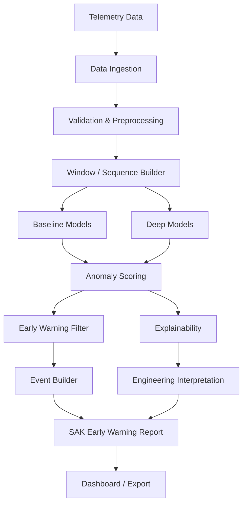

# SAK — Satellite Anomaly Knowledge

> Her model alarm üretir; SAK alarmın nedenini de açıklar.

SAK, çok değişkenli uydu telemetrisi üzerinde normal davranışı öğrenen,
anomalileri olay seviyesinde erken uyarıya dönüştüren ve kararlarını kanal,
zaman aralığı ve alt sistem düzeyinde açıklayan modüler bir araştırma
prototipidir.

Proje, TÜBİTAK 2209-B ve TUSAŞ odaklı araştırma-geliştirme çalışması için
tasarlanmıştır. İlk hedef en karmaşık modeli kurmak değil; tekrarlanabilir,
test edilebilir, veri kaynağından bağımsız ve mühendislik açısından
açıklanabilir bir temel oluşturmaktır.

## Temel ilkeler

- Önce veri kalitesi ve güçlü baseline modeller.
- Kronolojik bölme ve sıfır gelecek bilgisi sızıntısı.
- Ham skor yerine filtrelenmiş, olay-temelli alarm üretimi.
- Her model için kanal ve zaman katkısı çıktısı.
- Accuracy yerine yanlış alarm, olay yakalama ve alarm gecikmesi dengesi.
- GNN ancak kanal ilişkileri ve baseline değerlendirmesi olgunlaştığında.
- XAI, sonradan eklenen bir görsel değil, model sözleşmesinin parçasıdır.

## Sistem akışı



## Sürüm yolu

| Sürüm | Odak | Ana teslimat |
|---|---|---|
| SAK-v0 | Veri altyapısı | Veri şeması, sentetik veri, pencereleme |
| SAK-v1 | Baseline | PCA, istatistiksel yöntemler, kanal katkısı |
| SAK-v2 | Derin modeller | Dense AE, LSTM/TCN AE, hata heatmap'i |
| SAK-v3 | XAI | Attribution, subsystem yorumu, otomatik rapor |
| SAK-v4 | Grafik modeller | GNN/GAT, node-edge önemi, kök neden sıralaması |

## Repository haritası

```text
SAK/
├── configs/                    Deney ve veri konfigürasyonları
├── data/                       Versiyon kontrolü dışında tutulan veri alanı
├── dashboards/                 Operatör/mühendis arayüzleri
├── docs/                       Mimari ve araştırma belgeleri
├── experiments/                Tekrarlanabilir deney tanımları
├── notebooks/                  Yalnızca keşif ve sonuç inceleme
├── reports/                    Rapor şablonları ve üretilen raporlar
├── src/sak/
│   ├── data/                   Dataset adaptörleri ve şema doğrulama
│   ├── preprocessing/          Resampling, eksik veri, ölçekleme
│   ├── features/               Pencere ve bağlam özellikleri
│   ├── models/                 Ortak model API'si ve model aileleri
│   ├── anomaly/                Skor, threshold, alarm ve event mantığı
│   ├── xai/                    Attribution ve subsystem eşleme
│   ├── evaluation/             Point/event metrikleri
│   ├── visualization/          Grafik ve heatmap üretimi
│   ├── reporting/              Mühendislik raporları
│   └── utils/                  Seed, logging ve ortak yardımcılar
└── tests/                      Birim ve entegrasyon testleri
```

Her klasörün sorumluluğu ve katman sınırları
[mimari belgesinde](docs/architecture.md) açıklanmıştır.

## Başlangıç

Python 3.11 veya üzeri önerilir.

```powershell
python -m venv .venv
.\.venv\Scripts\Activate.ps1
python -m pip install -e ".[dev]"
pytest
```

Tek ve çoklu seed deney CLI'ları `experiments/` altında bulunur. Uygulama
sırası ve kabul ölçütleri [MVP backlog'unda](docs/mvp-backlog.md) tanımlıdır.

## Belgeler

- [Sistem mimarisi](docs/architecture.md)
- [Aşamalı yol haritası](docs/roadmap.md)
- [Modelleme, XAI ve değerlendirme](docs/modeling-xai-evaluation.md)
- [MVP backlog, 4 haftalık plan ve riskler](docs/mvp-backlog.md)
- [Araştırma ve rapor planı](docs/research-plan.md)
- [İlk sentetik model deneyi](docs/experiment-001-synthetic-baselines.md)

## İlk sentetik deneyi çalıştırma

```powershell
$env:PYTHONPATH="src"
python experiments/run_synthetic_models.py
```

Komut 14 günlük sentetik telemetri üretir, PCA ve Dense Autoencoder eğitir,
event/XAI metriklerini hesaplar ve `artifacts/synthetic_models/` altında
checkpoint, skor, grafik ve rapor artefact'larını oluşturur.

Deney tamamlandığında basit UI/UX kontrolü için statik dashboard da üretilir:

```text
dashboards/sak_synthetic_dashboard.html
```

## Veri kaynakları

- ESA Anomaly Dataset: üç gerçek ESA görevinden açıklamalı telemetri.
- NASA/JPL SMAP-MSL: Telemanom çalışmasında kullanılan uzay aracı
  telemetri serileri.
- SAK sentetik veri üreteci: gerçek veri erişiminden önce pipeline ve XAI
  doğrulaması için planlanmıştır.

Veri dosyaları lisansları ve boyutları nedeniyle repository'ye eklenmez.

## Current SAK Pipeline

The current research pipeline is:

1. Generate deterministic synthetic satellite telemetry and injection metadata.
2. Create chronological train, calibration, validation and test partitions.
3. Fit preprocessing only on the training partition.
4. Fit PCA, Dense Autoencoder and optionally TCN Autoencoder models.
5. Select global and operational-mode-aware thresholds on calibration data.
6. Apply EWMA and persistence filtering, then build detected events.
7. Calculate point, event, critical-region, delay, lead-time and false-alarm metrics.
8. Produce channel and subsystem reconstruction-error attribution.
9. Export engineering reports, diagnostics, comparison tables and a dashboard.

## SAK-v2.1 Evaluation Stabilization

SAK-v2.1 standardizes every model and threshold combination as a model
variant. The canonical keys are:

```text
pca_global
pca_mode_aware
dense_autoencoder_global
dense_autoencoder_mode_aware
```

The same keys are used by `comparison.json`, `comparison.csv`, artifact
directories and dashboard diagnostics. Each run also writes
`run_manifest.json` with the seed, dataset checksum, split boundaries, model
variants, configuration path and optional Git hash.

## How To Run Synthetic Experiment

From the repository root:

```powershell
python experiments/run_synthetic_models.py
```

An explicit seed or output directory can be supplied:

```powershell
python experiments/run_synthetic_models.py --seed 42 --output artifacts/synthetic_models
```

Run only the temporal model or all current baselines:

```powershell
python experiments/run_synthetic_models.py --models tcn_autoencoder
python experiments/run_synthetic_models.py --models pca dense_autoencoder tcn_autoencoder
python experiments/run_synthetic_models.py --models tcn_autoencoder --calibration constrained_event_f1
python experiments/run_synthetic_models.py --models tcn_autoencoder --calibration constrained_event_f1 --score-transform log1p
```

## How To Run Multi-Seed Experiment

The multi-seed runner executes isolated sequential runs and aggregates metrics
by model variant:

```powershell
python experiments/run_multiseed_synthetic.py --seeds 1 2 3 4 5
python experiments/run_multiseed_synthetic.py --seeds 1 2 3 --models pca dense_autoencoder tcn_autoencoder
python experiments/run_multiseed_synthetic.py --seeds 1 2 3 --models pca dense_autoencoder tcn_autoencoder --calibration constrained_event_f1
python experiments/run_temporal_ablation.py --seeds 1 2 3
```

Each seed is written under `artifacts/multiseed/seed_NNN/`.
`aggregate_results.csv` and `aggregate_results.json` contain mean and
population standard deviation for point, event, false-alarm, delay,
early-warning and XAI hit metrics.

## Generated Artifacts

```text
artifacts/synthetic_models/
|-- comparison.json
|-- comparison.csv
|-- operating_point_comparison.csv
|-- data_quality_report.json
|-- split_manifest.json
|-- run_manifest.json
|-- pca_global/
|   |-- scores.csv
|   |-- predictions.csv
|   |-- event_diagnostics.csv
|   |-- false_positive_diagnostics.csv
|   |-- diagnostics/
|   |   |-- score_distribution.json
|   |   |-- false_positive_context.json
|   |   |-- filter_sweep.csv
|   |   |-- anomaly_type_performance.csv
|   |   |-- operating_point_selection.json
|   |   |-- calibration_partition_metrics.json
|   |   |-- validation_partition_metrics.json
|   |   `-- test_partition_metrics.json
|   |-- reports/
|   |-- xai/
|   `-- plots/
|-- pca_mode_aware/
|-- dense_autoencoder_global/
|-- dense_autoencoder_mode_aware/
|-- tcn_autoencoder_global/
|   |-- xai/temporal_error_summary.json
|   `-- plots/temporal_window_error_heatmap.png
`-- tcn_autoencoder_mode_aware/
```

Machine-facing and human-facing reports are also written to
`reports/generated/<model_variant>/`.

## Early Warning Report Format

Every detected event produces matching `SAK-NNNN.md` and `SAK-NNNN.json`
files from one canonical report payload. The JSON includes model identity,
threshold strategy, event and critical-window times, score, threshold, risk,
ranked channel contributions, subsystem contribution mass, engineering
interpretation, inspection guidance, uncertainty and reproducibility metadata.

## SAK-v2.2 Temporal Autoencoder

The Dense Autoencoder reconstructs each timestamp independently. The optional
TCN Autoencoder reconstructs fixed-length windows and uses dilated temporal
convolutions to represent local trend, drift and cross-time behavior.

Windowing is always applied separately after the chronological train,
calibration, validation and test split. Window-position reconstruction errors
are mapped back to timestamps by averaging or taking the maximum over
overlapping windows. The resulting timestamp score and channel errors then
enter the same threshold, EWMA, persistence, event evaluation, attribution and
report pipeline used by PCA and Dense AE.

Temporal XAI retains the standard channel/subsystem explanation and adds:

- `xai/temporal_error_summary.json`;
- `plots/temporal_window_error_heatmap.png`;
- timestamp-aligned channel errors for critical-window attribution.

The TCN is opt-in so routine PCA/Dense AE runs retain their previous runtime:

```powershell
python experiments/run_synthetic_models.py --models tcn_autoencoder
```

## SAK-v2.3 Temporal Calibration

Temporal reconstruction scores have a different distribution from PCA and
Dense AE scores, so one fixed quantile and alarm filter need not be equally
appropriate for every model family. SAK-v2.3 introduced optional TCN score
transforms (`none`, `log1p`, `robust_zscore`), threshold/filter selection and
richer false-positive diagnostics. Its main limitation was that the synthetic
validation partition was nominal-only, so event recall constraints could not
be tuned meaningfully.

SAK-v2.4 moves operating-point selection to the anomalous calibration
partition. `robust_zscore` is fitted only on nominal calibration scores.
Per-variant diagnostics expose score distributions, threshold margins,
false-positive operational context, filter-sweep results and anomaly-type
performance. Test metrics are never used for selection.
`likely_reason` values are diagnostic hints rather than root-cause claims.

GNN/GAT remains deferred until temporal calibration is validated with
representative anomalous calibration, validation and held-out test events.

## SAK-v2.4 Anomalous Calibration & Data Realism

SAK-v2.4 uses a chronological `train / calibration / validation / test`
design. Train is nominal-only. Calibration contains controlled anomalies and
benign transients and is the only partition used to select thresholds and
filters. Validation is an independent sanity check. Test remains held out for
final reporting and never influences selection.

Every anomaly has a precursor start, anomaly onset and critical-region start.
Metrics include anomaly-onset delay, lead time to critical, critical-region
recall, detection-before-critical rate and precursor detection rate. Fixed
quantile and selected operating points are compared on the same test data in
`operating_point_comparison.csv`.

The synthetic frame now contains 29 correlated telemetry channels across EPS,
thermal, AOCS, communications and payload groups. It includes
nominal/payload/maneuver/safe modes, maneuver and safe-mode context, three
severity levels and benign operational transients.

This data is suitable for pipeline tests, leakage checks, reproducible
PCA/Dense AE/TCN comparisons, artifact contracts and controlled injection
studies. It is not sufficient for real mission performance claims, industrial
acceptance, proof of universal TCN superiority or learned graph topology.

The adapter API is available under `sak.data.adapters`. NASA SMAP/MSL and
ESA-ADB adapters currently fail explicitly until source-specific schema
mapping is implemented. Real performance claims require evaluation through
one of these or another mission dataset. GNN/GAT remains deferred.

## SAK-v2.5 Dashboard & Critical Early-Warning Metrics

SAK-v2.5 tightens early-warning metrics so `critical_region_recall` is no
longer a synonym for event recall. Event recall means an injected event was
matched at all. Critical-region recall means the alarm arrived before the
critical region or overlapped it while it was active. The dashboard also
reports `detected_before_critical_rate`, `late_detection_rate`,
`missed_critical_count`, median lead time and p10 lead time.

Operating-point selection still uses calibration only. Its constraints now
include event recall, critical-region recall, before-critical rate and maximum
false alarms/day. Test metrics remain final reporting only.

The static dashboard defaults to the current selected global operating points:
`pca_global`, `dense_autoencoder_global` and `tcn_autoencoder_global`.
Mode-aware, fixed-quantile, sweep and older diagnostic details remain
available under the Advanced / Legacy section instead of crowding the default
view.

Subsystem colors are fixed across cards, badges, plots and tables: EPS amber,
THERMAL red, AOCS blue, COMM purple, PAYLOAD green and UNKNOWN gray. The NASA
SMAP/MSL adapter now supports inspect/validate workflows and can load a
normalized `telemetry.csv` or `telemetry.parquet` staging folder; raw
Telemanom arrays still require sequence/channel mapping before full loading.

## Temporal Windowing

`sak.features.windowing.build_windows` prepares data for temporal models:

```python
from sak.features import build_windows

train_windows = build_windows(
    train_values,
    timestamps=train_timestamps,
    labels=train_labels,
    window_size=60,
    stride=1,
    label_mode="any",
)
X_train = train_windows.X_windows
```

Windowing must be called separately after the chronological train,
calibration, validation and test split. Concatenating partitions before
windowing can create boundary-crossing windows and future-data leakage.
Supported label modes are `any`, `last` and `majority`.

## Why GNN Is Deferred

GNN/GAT work is intentionally deferred until the following foundations are
stable:

- data contracts and leakage-safe preprocessing;
- event-level evaluation and delay metrics;
- artifact and dashboard consistency;
- machine-readable XAI reports;
- multi-seed validation;
- temporal windowing and temporal baselines.

Only after these layers are validated should graph topology, edge semantics and
graph attribution be introduced. This keeps future GNN results comparable to
trusted non-graph baselines instead of adding model complexity before the
evaluation system is ready.

The temporal experiment design is documented in
[Experiment 002](docs/experiment-002-temporal-autoencoder.md). Calibration
and false-alarm suppression are documented in
[Experiment 003](docs/experiment-003-temporal-calibration.md). The anomalous
calibration split and data-realism design are documented in
[Experiment 004](docs/experiment-004-anomalous-calibration-and-data-realism.md).
Critical early-warning metrics and the dashboard cleanup are documented in
[Experiment 005](docs/experiment-005-critical-metrics-and-dashboard.md).
