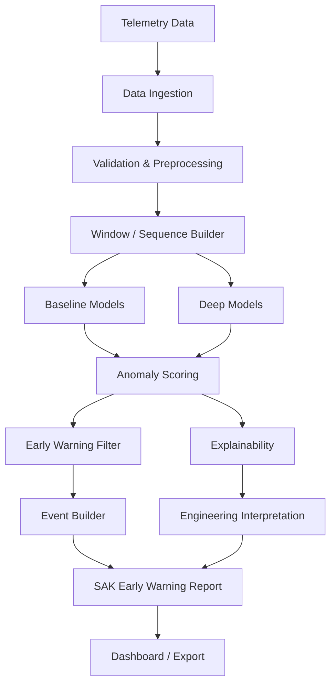

# SAK — Satellite Anomaly Knowledge

> Her model alarm üretir; SAK alarmın nedenini de açıklar.

SAK, çok değişkenli uydu telemetrisi üzerinde normal davranışı öğrenen,
anomalileri olay seviyesinde erken uyarıya dönüştüren ve kararlarını kanal,
zaman aralığı ve alt sistem düzeyinde açıklayan modüler bir araştırma
prototipidir.

Proje, TÜBİTAK 2209-B ve TUSAŞ odaklı araştırma-geliştirme çalışması için
tasarlanmıştır. İlk hedef en karmaşık modeli kurmak değil; tekrarlanabilir,
test edilebilir, veri kaynağından bağımsız ve mühendislik açısından
açıklanabilir bir temel oluşturmaktır.

## Temel ilkeler

- Önce veri kalitesi ve güçlü baseline modeller.
- Kronolojik bölme ve sıfır gelecek bilgisi sızıntısı.
- Ham skor yerine filtrelenmiş, olay-temelli alarm üretimi.
- Her model için kanal ve zaman katkısı çıktısı.
- Accuracy yerine yanlış alarm, olay yakalama ve alarm gecikmesi dengesi.
- GNN ancak kanal ilişkileri ve baseline değerlendirmesi olgunlaştığında.
- XAI, sonradan eklenen bir görsel değil, model sözleşmesinin parçasıdır.

## Sistem akışı



## Sürüm yolu

| Sürüm | Odak | Ana teslimat |
|---|---|---|
| SAK-v0 | Veri altyapısı | Veri şeması, sentetik veri, pencereleme |
| SAK-v1 | Baseline | PCA, istatistiksel yöntemler, kanal katkısı |
| SAK-v2 | Derin modeller | Dense AE, LSTM/TCN AE, hata heatmap'i |
| SAK-v3 | XAI | Attribution, subsystem yorumu, otomatik rapor |
| SAK-v4 | Grafik modeller | GNN/GAT, node-edge önemi, kök neden sıralaması |

## Repository haritası

```text
SAK/
├── configs/                    Deney ve veri konfigürasyonları
├── data/                       Versiyon kontrolü dışında tutulan veri alanı
├── dashboards/                 Operatör/mühendis arayüzleri
├── docs/                       Mimari ve araştırma belgeleri
├── experiments/                Tekrarlanabilir deney tanımları
├── notebooks/                  Yalnızca keşif ve sonuç inceleme
├── reports/                    Rapor şablonları ve üretilen raporlar
├── src/sak/
│   ├── data/                   Dataset adaptörleri ve şema doğrulama
│   ├── preprocessing/          Resampling, eksik veri, ölçekleme
│   ├── features/               Pencere ve bağlam özellikleri
│   ├── models/                 Ortak model API'si ve model aileleri
│   ├── anomaly/                Skor, threshold, alarm ve event mantığı
│   ├── xai/                    Attribution ve subsystem eşleme
│   ├── evaluation/             Point/event metrikleri
│   ├── visualization/          Grafik ve heatmap üretimi
│   ├── reporting/              Mühendislik raporları
│   └── utils/                  Seed, logging ve ortak yardımcılar
└── tests/                      Birim ve entegrasyon testleri
```

Her klasörün sorumluluğu ve katman sınırları
[mimari belgesinde](docs/architecture.md) açıklanmıştır.

## Başlangıç

Python 3.11 veya üzeri önerilir.

```powershell
python -m venv .venv
.\.venv\Scripts\Activate.ps1
python -m pip install -e ".[dev]"
pytest
```

Tek ve çoklu seed deney CLI'ları `experiments/` altında bulunur. Uygulama
sırası ve kabul ölçütleri [MVP backlog'unda](docs/mvp-backlog.md) tanımlıdır.

## Belgeler

- [Sistem mimarisi](docs/architecture.md)
- [Aşamalı yol haritası](docs/roadmap.md)
- [Modelleme, XAI ve değerlendirme](docs/modeling-xai-evaluation.md)
- [MVP backlog, 4 haftalık plan ve riskler](docs/mvp-backlog.md)
- [Araştırma ve rapor planı](docs/research-plan.md)
- [İlk sentetik model deneyi](docs/experiment-001-synthetic-baselines.md)

## İlk sentetik deneyi çalıştırma

```powershell
$env:PYTHONPATH="src"
python experiments/run_synthetic_models.py
```

Komut 14 günlük sentetik telemetri üretir, PCA ve Dense Autoencoder eğitir,
event/XAI metriklerini hesaplar ve `artifacts/synthetic_models/` altında
checkpoint, skor, grafik ve rapor artefact'larını oluşturur.

Deney tamamlandığında basit UI/UX kontrolü için statik dashboard da üretilir:

```text
dashboards/sak_synthetic_dashboard.html
```

## Veri kaynakları

- ESA Anomaly Dataset: üç gerçek ESA görevinden açıklamalı telemetri.
- NASA/JPL SMAP-MSL: Telemanom çalışmasında kullanılan uzay aracı
  telemetri serileri.
- SAK sentetik veri üreteci: gerçek veri erişiminden önce pipeline ve XAI
  doğrulaması için planlanmıştır.

Veri dosyaları lisansları ve boyutları nedeniyle repository'ye eklenmez.

## Current SAK Pipeline

The current research pipeline is:

1. Generate deterministic synthetic satellite telemetry and injection metadata.
2. Create chronological train, validation and test partitions.
3. Fit preprocessing only on the training partition.
4. Fit PCA and Dense Autoencoder reconstruction models.
5. Calibrate global and operational-mode-aware thresholds on validation data.
6. Apply EWMA and persistence filtering, then build detected events.
7. Calculate point, event, delay and false-alarm metrics.
8. Produce channel and subsystem reconstruction-error attribution.
9. Export engineering reports, diagnostics, comparison tables and a dashboard.

## SAK-v2.1 Evaluation Stabilization

SAK-v2.1 standardizes every model and threshold combination as a model
variant. The canonical keys are:

```text
pca_global
pca_mode_aware
dense_autoencoder_global
dense_autoencoder_mode_aware
```

The same keys are used by `comparison.json`, `comparison.csv`, artifact
directories and dashboard diagnostics. Each run also writes
`run_manifest.json` with the seed, dataset checksum, split boundaries, model
variants, configuration path and optional Git hash.

## How To Run Synthetic Experiment

From the repository root:

```powershell
python experiments/run_synthetic_models.py
```

An explicit seed or output directory can be supplied:

```powershell
python experiments/run_synthetic_models.py --seed 42 --output artifacts/synthetic_models
```

## How To Run Multi-Seed Experiment

The multi-seed runner executes isolated sequential runs and aggregates metrics
by model variant:

```powershell
python experiments/run_multiseed_synthetic.py --seeds 1 2 3 4 5
```

Each seed is written under `artifacts/multiseed/seed_NNN/`.
`aggregate_results.csv` and `aggregate_results.json` contain mean and
population standard deviation for point, event, false-alarm, delay,
early-warning and XAI hit metrics.

## Generated Artifacts

```text
artifacts/synthetic_models/
|-- comparison.json
|-- comparison.csv
|-- run_manifest.json
|-- pca_global/
|   |-- scores.csv
|   |-- predictions.csv
|   |-- event_diagnostics.csv
|   |-- false_positive_diagnostics.csv
|   |-- reports/
|   |-- xai/
|   `-- plots/
|-- pca_mode_aware/
|-- dense_autoencoder_global/
`-- dense_autoencoder_mode_aware/
```

Machine-facing and human-facing reports are also written to
`reports/generated/<model_variant>/`.

## Early Warning Report Format

Every detected event produces matching `SAK-NNNN.md` and `SAK-NNNN.json`
files from one canonical report payload. The JSON includes model identity,
threshold strategy, event and critical-window times, score, threshold, risk,
ranked channel contributions, subsystem contribution mass, engineering
interpretation, inspection guidance, uncertainty and reproducibility metadata.

## Temporal Windowing Roadmap

`sak.features.windowing.build_windows` prepares data for future temporal
models:

```python
from sak.features import build_windows

train_windows = build_windows(
    train_values,
    timestamps=train_timestamps,
    labels=train_labels,
    window_size=60,
    stride=1,
    label_mode="any",
)
X_train = train_windows.X_windows
```

Windowing must be called separately after the chronological train, validation
and test split. Concatenating partitions before windowing can create
boundary-crossing windows and future-data leakage. Supported label modes are
`any`, `last` and `majority`.

## Why GNN Is Deferred

GNN/GAT work is intentionally deferred until the following foundations are
stable:

- data contracts and leakage-safe preprocessing;
- event-level evaluation and delay metrics;
- artifact and dashboard consistency;
- machine-readable XAI reports;
- multi-seed validation;
- temporal windowing and temporal baselines.

Only after these layers are validated should graph topology, edge semantics and
graph attribution be introduced. This keeps future GNN results comparable to
trusted non-graph baselines instead of adding model complexity before the
evaluation system is ready.
