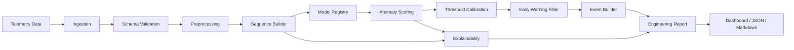

# SAK Sistem Mimarisi

## 1. Vizyon ve kapsam

### Kısa teknik tanım

SAK, çok değişkenli uydu telemetrisinden nominal davranış modeli çıkaran,
sapmaları anomali skoru olarak ölçen, zamansal filtrelerle olay seviyesinde
erken uyarı üreten ve alarm nedenini kanal, zaman ve alt sistem düzeyinde
açıklayan bir karar destek sistemidir.

SAK bir uçuş-kritik otonom karar sistemi olarak değil, yer operasyon
mühendisinin inceleme önceliğini ve kök neden araştırmasını destekleyen bir
prototip olarak konumlandırılır.

### Sanayi ve TUSAŞ açısından değer önerisi

- Çok sayıdaki housekeeping kanalını sürekli ve tutarlı biçimde izleme.
- Sabit limit aşılmadan gelişen drift ve ilişki bozulmalarını yakalama.
- Yanlış alarmı persistence, operasyon modu ve olay bağlamıyla azaltma.
- Alarm inceleme süresini top-k kanal, kritik pencere ve subsystem önerisiyle
  kısaltma.
- Yeni platform veya kapalı sanayi verisine model kodunu değiştirmeden veri
  adaptörü ve konfigürasyon üzerinden geçiş.
- Deneylerin veri sürümü, config, seed ve model artefact'larıyla yeniden
  üretilebilmesi.

### Neden yalnızca anomaly detection değil?

Bir anomaly detector çoğunlukla her zaman adımı için bir skor üretir.
Operasyonel erken uyarı sistemi ise şu ek soruları yanıtlamalıdır:

1. Skor, alarm üretmek için yeterince yüksek ve kalıcı mı?
2. Aynı davranış belirli bir operasyon modu için normal olabilir mi?
3. Alarm tek bir noktadan mı, anlamlı bir olaydan mı oluşuyor?
4. Hangi kanallar ve hangi zaman aralığı kararı taşıyor?
5. Bulgular hangi alt sistemle ilişkilendirilebilir?
6. Güven düzeyi ve modelin bilmediği durumlar nelerdir?

Bu nedenle SAK çıktısı `score` değil; filtrelenmiş `AlarmEvent`,
`ExplanationResult` ve mühendislik raporudur.

### Araştırma ve mühendislik çıktıları

**Araştırma çıktıları**

- Klasik ve derin anomaly detection yöntemlerinin aynı protokolde karşılaştırması.
- Point-wise ve event-wise performans arasındaki farkın analizi.
- Erken uyarı gecikmesi ile yanlış alarm arasındaki trade-off.
- Reconstruction tabanlı açıklamalar ile post-hoc XAI yöntemlerinin uyumu.
- Kanal katkılarının bilinen anomaly injection ground truth'u ile doğrulanması.
- Yeterli veri varsa grafik tabanlı kök neden sıralamasının katkısı.

**Mühendislik çıktıları**

- Dataset bağımsız veri adaptörü.
- Tekrarlanabilir preprocessing ve pencereleme pipeline'ı.
- Ortak model, skor, alarm ve açıklama sözleşmeleri.
- Otomatik metrik, görsel ve SAK Early Warning Report üretimi.
- Yeni model ve veri kaynağı eklemeye uygun Python paketi.

## 2. Katmanlı mimari



### 2.1 Telemetry Data

Beklenen girdiler:

- Sürekli veya düzensiz örneklenmiş sayısal telemetri kanalları.
- Kategorik durum ve operasyon modu kanalları.
- Yörünge fazı, eclipse/sunlight ve konum gibi bağlamsal alanlar.
- Varsa telecommand, event ve anomaly interval kayıtları.

Ham veri değiştirilemez kabul edilir. Dönüştürülmüş veri ayrı bir sürüm ve
manifest ile saklanır.

### 2.2 Data Ingestion Layer

Sorumluluklar:

- CSV, Parquet ve gelecekte görev-özel arşiv formatlarını okumak.
- Timestamp'i UTC'ye çevirmek, sıralamak ve benzersizliği denetlemek.
- Kaynak kolonlarını kanonik kanal adlarına eşlemek.
- Sayısal, kategorik, context ve label kolonlarını ayırmak.
- Veri kaynağı, görev, zaman aralığı ve checksum metadata'sı üretmek.

Dataset adaptörleri ortak `TelemetryDataSource` arayüzünü uygular. ESA,
SMAP/MSL ve sanayi verisi için ayrı adaptörler olabilir; alt katmanlar
verinin nereden geldiğini bilmez.

### 2.3 Schema Validation

Kontroller:

- Timestamp monotonluğu ve duplicate kayıtlar.
- Beklenen kanal listesi, veri tipi ve fiziksel birim.
- Örnekleme sıklığı ve kanal başına kapsama oranı.
- Fiziksel olarak imkânsız değerler.
- Label interval'larının veri zaman aralığında kalması.
- Context kolonlarında bilinmeyen kategori oranı.

Hatalar sessizce düzeltilmez. Her düzeltme veri kalite raporuna yazılır.

### 2.4 Preprocessing Layer

Önerilen sıra:

1. Timestamp parsing ve UTC standardizasyonu.
2. Kronolojik sıralama ve duplicate çözümü.
3. Veri kalite maskelerinin oluşturulması.
4. Ortak zaman ızgarasına resampling.
5. Kısa boşluklarda sınırlı interpolation.
6. Uzun boşlukların maskelenmesi veya pencerenin dışlanması.
7. Fiziksel limit dışı ölçümlerin işaretlenmesi.
8. Eğitim parçasında scaler fit edilmesi.
9. Validation ve test'e yalnızca `transform` uygulanması.
10. Context ve operasyon modu özelliklerinin eklenmesi.

**Eksik veri**

- Kısa boşluk: zaman tabanlı interpolation ve `was_imputed` maskesi.
- Uzun boşluk: doldurmak yerine pencereyi geçersiz sayma veya modele mask
  verme.
- Stuck sensor ihtimali: forward-fill ile kapatılmamalı; ayrıca anomaly
  özelliği olarak korunmalı.

**Outlier handling**

Anomali olabilecek uç değerler genel bir winsorization ile yok edilmez.
Yalnızca sensör ölçüm aralığının fiziksel olarak imkânsız olduğu bilinen
değerler veri kalite hatası olarak ayrılır.

**Normalization**

- İlk tercih: `RobustScaler`, özellikle ağır kuyruklu kanallarda.
- Karşılaştırma: StandardScaler.
- Kategorik context: one-hot veya embedding.
- Scaler yalnızca training partition üzerinde fit edilir ve checkpoint ile
  birlikte saklanır.

### 2.5 Leakage Prevention

Başlıca sızıntı riskleri:

- Random train/test split ile aynı anomaly olayının iki bölüme dağılması.
- Tüm veri üzerinde scaler veya PCA fit edilmesi.
- Test dağılımına bakarak threshold seçilmesi.
- Gelecek zaman adımlarını interpolation veya rolling feature içinde kullanmak.
- Anomaly label'ını feature veya pencere seçim sinyali olarak modele vermek.
- Aynı görevin bitişik ve örtüşen pencerelerini farklı split'lere koymak.
- Model seçimini test F1'a göre yapmak.

Zorunlu kurallar:

- Split önce zaman aralıkları düzeyinde, sonra window üretimi yapılır.
- Train nominal-only ise bu seçim yalnızca eğitim politikasıdır; validation
  ve test anomalileri korunur.
- Scaler, imputation istatistikleri, PCA, threshold ve model fit işlemleri
  ayrı ayrı hangi partition'ı kullandığını loglar.
- Test seti yalnızca son rapor için bir kez değerlendirilir.

### 2.6 Windowing / Sequence Builder

Her pencere şu öğeleri taşır:

- `values`: `[window, channels]`
- `timestamps`
- `validity_mask`
- `imputation_mask`
- `context`
- `event_labels` yalnızca evaluation tarafında
- kaynak satır aralığı ve veri sürümü

Window uzunluğu model hiperparametresidir. Birden fazla fiziksel zaman
ölçeğini karşılaştırmak için 15, 30, 60 ve 120 dakikalık pencereler
denenebilir. Stride, alarm gecikmesini ve hesap maliyetini doğrudan etkiler.

### 2.7 Baseline Models

Baseline katmanı şu soruya cevap verir: derin model, daha basit ve daha
açıklanabilir yöntemlerden gerçekten daha iyi mi?

- Sabit limit ve rate-of-change kontrolleri
- Z-score / rolling z-score
- Moving average ve EWMA residual
- PCA reconstruction error
- Isolation Forest
- One-Class SVM, yalnızca ölçek uygunsa

Tüm modeller ortak `AnomalyModel` sözleşmesine uyar ve aggregate score ile
mümkünse channel error döndürür.

### 2.8 Deep Anomaly Detection Models

Önerilen sıra:

1. Dense Autoencoder: kanal ilişkileri için sade reconstruction baseline.
2. TCN Autoencoder: paralel, kararlı ve çok ölçekli zamansal örüntüler.
3. LSTM Autoencoder: uzun süreli bağımlılık karşılaştırması.
4. Transformer: veri hacmi ve baseline sonucu haklı çıkarırsa opsiyonel.
5. GNN/GAT: güvenilir graph ve yeterli değerlendirme zemini varsa.

Derin modeller train nominal-only veya ağırlıklı robust training
stratejisiyle eğitilir. Checkpoint; model, scaler, kanal sırası, config ve
threshold bilgilerini birlikte taşır.

### 2.9 Anomaly Scoring

Skor katmanı model çıktısını standartlaştırır:

- Nokta/pencere aggregate anomaly score.
- Kanal bazlı reconstruction veya prediction error.
- İsteğe bağlı belirsizlik skoru.
- Score kalibrasyonu için validation nominal dağılımı.

PCA/AE başlangıç skoru:

```text
channel_error[t, j] = (x[t, j] - x_hat[t, j])²
score[t] = weighted_mean_j(channel_error[t, j])
```

Kanal ölçeği normalizasyondan sonra dahi farklı hata varyansları üretebilir.
Bu nedenle contribution değerleri validation nominal hata dağılımına göre
robust biçimde standardize edilebilir.

### 2.10 Early Warning Filter

Ham score doğrudan alarm değildir. Sıra:

1. Validation üzerinden sabit veya dinamik threshold.
2. EWMA ya da causal moving average ile smoothing.
3. `m-of-n` persistence.
4. Bitişik alarm noktalarını event'e birleştirme.
5. Cooldown ve duplicate event suppression.
6. Operasyon modu ve bakım/komut bağlamıyla false positive suppression.
7. Risk seviyesi üretimi.

Filtre nedensel olmalıdır; zaman `t` alarmında `t+1` ve sonrası kullanılamaz.

### 2.11 Explainability Layer

Her model adapter'ı en az bir doğal açıklama üretmelidir:

- PCA: residual ve loading tabanlı kanal katkısı.
- AE: kanal-zaman reconstruction error.
- Temporal model: error, occlusion ve Integrated Gradients.
- Tree modeli: SHAP.
- GNN: node/edge importance ve ilgili alt grafik.

Post-hoc XAI doğal model açıklamasını tamamlar; onun yerine geçmez.
Açıklama payload'ı modelden bağımsız `ExplanationResult` olarak rapor
katmanına iletilir.

### 2.12 Engineering Report / Dashboard

Rapor minimum olarak şunları içerir:

- Alarm ve event zamanı.
- Ham/filtrelenmiş skor ve threshold.
- Risk seviyesi.
- Top-k katkı sağlayan kanallar.
- Kritik zaman penceresi.
- Olası subsystem.
- Operasyon modu, eclipse ve yörünge bağlamı.
- Mühendislik yorumu, belirsizlik ve önerilen inceleme.

Dashboard karar vermek yerine kanıtları birlikte sunar. Ham kanal eğrisi,
nominal karşılaştırma ve açıklama heatmap'i rapordan erişilebilir olmalıdır.

## 3. Repository sorumlulukları

| Yol | Sorumluluk |
|---|---|
| `configs/` | Veri, model, threshold ve deney ayarları |
| `data/raw/` | Değiştirilmeyen kaynak veri |
| `data/processed/` | Şeması doğrulanmış ve sürümlenmiş veri |
| `data/synthetic/` | Simülatör çıktıları ve injection manifestleri |
| `notebooks/` | EDA ve sonuç inceleme; üretim kodu içermez |
| `src/sak/data/` | Kaynak adaptörleri, kanonik şema, manifest |
| `src/sak/preprocessing/` | Causal temizleme, resampling, scaling |
| `src/sak/features/` | Window, sequence ve context builder |
| `src/sak/models/baselines/` | PCA, Isolation Forest, OCSVM |
| `src/sak/models/autoencoders/` | Dense AE |
| `src/sak/models/temporal/` | TCN, LSTM, opsiyonel Transformer |
| `src/sak/models/graph/` | Graph builder, GNN/GAT |
| `src/sak/anomaly/` | Score kalibrasyonu, threshold, event filter |
| `src/sak/xai/` | Attribution, occlusion, subsystem mapping |
| `src/sak/evaluation/` | Point/event/delay/XAI metrikleri |
| `src/sak/visualization/` | Plot, heatmap ve zaman çizelgesi |
| `src/sak/reporting/` | Markdown/JSON mühendislik raporu |
| `experiments/` | Dondurulmuş config, metrik ve deney notları |
| `reports/` | Şablonlar ve otomatik çıktılar |
| `dashboards/` | Streamlit/Plotly gibi sunum uygulaması |
| `tests/` | Birim, entegrasyon ve leakage regression testleri |

## 4. Operasyonel olmayan gereksinimler

- Tüm deneylerde global seed kontrolü.
- Config dosyasının sonuç klasörüne kopyalanması.
- Veri ve model checksum'ı.
- Python logging; print tabanlı izleme yok.
- Model checkpoint ve preprocessing metadata birlikteliği.
- Type hint, docstring, lint, unit test.
- CI içinde hızlı sentetik smoke test.
- Büyük veri ve checkpoint'lerin Git dışında artefact store'da tutulması.
- Hassas sanayi verisi için erişim kontrolü ve loglarda veri sızıntısı
  önleme.

